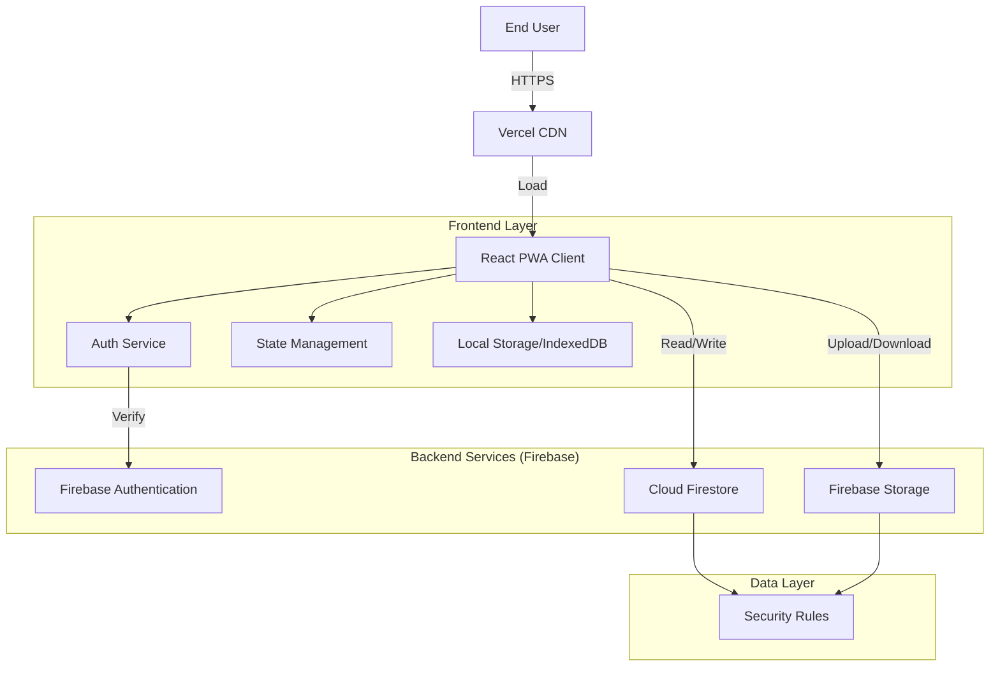

# 🏥 HealthCare+ Management System

### *Precision Healthcare Management with Real-time Monitoring & Secure Data Handling*

[](https://reactjs.org/)
[](https://www.typescriptlang.org/)
[](https://vitejs.dev/)
[](https://firebase.google.com/)
[](https://tailwindcss.com/)
[](LICENSE)

---

## 📖 Overview

**HealthCare+** is a comprehensive, engineering-first solution designed to bridge the gap between patients and chronic disease management. Unlike traditional health apps, this system prioritizes **data security**, **offline accessibility**, and **real-time insights**.

It uses a hybrid approach:
1.  **Real-time Synchronization** for immediate updates on patient status and alerts.
2.  **Offline-First Architecture** ensuring critical health data is always accessible, even in low-connectivity zones.

This ensures that no critical health alert is missed and patients stay adherent to their treatment plans securely.

---

## ✨ Key Features

- **🩺 Smart Patient Dashboard**: comprehensive view of daily tasks, upcoming appointments, and health summaries at a glance.
- **📊 Advanced Health Metrics**: Monitor vital signs (BP, Heart Rate, Glucose) with interactive charts and trend analysis to detect anomalies early.
- **💊 Intelligent Medication Management**:
    - Automated reminders and push notifications.
    - Inventory tracking to prevent stock-outs.
    - Adherence scoring to motivate patients.
- **📝 Symptom Analytics**: Detailed logging system that helps correlate symptoms with medication changes or lifestyle factors.
- **📅 Seamless Appointment Scheduling**: Integrated booking system with calendar sync and reminders.
- **🔒 Enterprise-Grade Security**:
    - **Authentication**: Robust RBAC (Role-Based Access Control) using Firebase Auth.
    - **Data Privacy**: End-to-end encrypted data transmission and strict Firestore security rules.
- **⚡ Performance Optimized**:
    - **PWA Support**: Installable on mobile and desktop devices.
    - **Fast Load**: Code splitting and lazy loading for a lightning-fast experience.

---

## 🏗️ Architecture

The system follows a modern serverless architecture to ensure scalability and maintainability.



---

## 🛠️ Tech Stack

| Component | Technology | Description |
|-----------|------------|-------------|
| **Frontend** | React 18 | Component-based UI methodology |
| **Language** | TypeScript | Type-safe code for better maintainability |
| **Styling** | Tailwind CSS | Utility-first CSS framework for rapid design |
| **Build Tool** | Vite | Next-generation frontend tooling |
| **Backend** | Firebase | Serverless backend (Auth, Firestore, Storage) |
| **Routing** | React Router v6 | Client-side routing |
| **Forms** | React Hook Form | Performant form validation |
| **State** | Context API + Hooks | Native state management |

---

## 🚀 Getting Started

Follow these steps to set up the project locally.

### Prerequisites

- Node.js (v16 or higher)
- npm or yarn
- A Firebase project

### Installation

1.  **Clone the repository**
    ```bash
    git clone https://github.com/shriramrajat/HealthCare.git
    cd HealthCare
    ```

2.  **Install dependencies**
    ```bash
    npm install
    ```

3.  **Environment Setup**
    Create a `.env` file in the root directory:
    ```bash
    cp .env.example .env
    ```

    Update `.env` with your Firebase credentials:
    ```env
    VITE_FIREBASE_API_KEY=your_api_key
    VITE_FIREBASE_AUTH_DOMAIN=your_auth_domain
    VITE_FIREBASE_PROJECT_ID=your_project_id
    VITE_FIREBASE_STORAGE_BUCKET=your_storage_bucket
    VITE_FIREBASE_MESSAGING_SENDER_ID=your_sender_id
    VITE_FIREBASE_APP_ID=your_app_id
    VITE_FIREBASE_MEASUREMENT_ID=your_measurement_id
    ```

4.  **Run Development Server**
    ```bash
    npm run dev
    ```

---

## � Deployment

### Vercel (Recommended)

The project is optimized for deployment on Vercel.

1.  Push your code to GitHub.
2.  Import the project into Vercel.
3.  Add the environment variables in the Vercel dashboard.
4.  Click **Deploy**.

### Manual Build

```bash
npm run build
npm run preview
```

---

## � License

This project is licensed under the MIT License - see the [LICENSE](LICENSE) file for details.

## 👥 Authors

- **Rajat Shriram** - *Initial Work* - [GitHub](https://github.com/shriramrajat)

---

> **Note**: This project is intended for educational and portfolio purposes.
